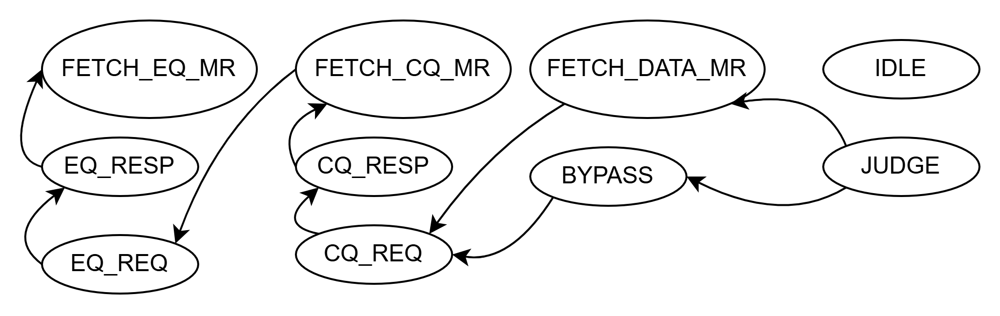

# ReqTransCore

Thread 2的状态机跳转如图所示：

<figure><figcaption>
Thread 2状态机
</figcaption></figure>

当Thread 2接收到上下文响应的时候，先判断当前待执行的sub-WQE是否为RDMA Read操作或者inline传输模式，如果是这两种情况则不需要读取数据MR，跳转至BYPASS状态，否则跳转至FETCH\_DATA\_MR状态。
