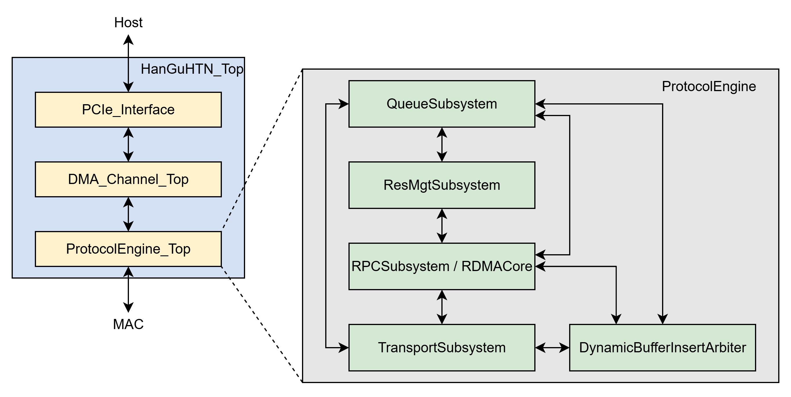

# 特性

- 京兆二号设计带宽为100 Gbps
- 数据位宽为512 bit，工作频率为200 MHz
- 网卡软件侧兼容标准verbs和socket编程接口
- 网卡网络侧兼容InfiniBand、RoCE和标准以太网协议。

# 微架构简介

京兆网卡的整体架构如下图所示：

<figure><figcaption></figcaption></figure>

PCIe Interface是网卡通过DMA与主机进行交互的接口。

网卡的核心模块是Protocol Engine。其中QueueSubsystem负责管理所有类型的队列资源，包括SQ、RQ、CQ、EQ；ResMgtSubsystem负责管理所有类型的通信状态资源，包括队列上下文、MPT、MTT；RDMACore是RDMA逻辑的核心部分，解析WQE、进行虚实地址转换，并将数据负载发送给传输子系统TransportSubsystem。

# 软件支持

京兆二号网卡的软件部分包含有内核态驱动ib_hgrnic和用户态驱动libhgrnic。

内核态驱动的主要负责网卡的配置，包括初始化设备、创建队列资源、分配ICM空间等；用户态驱动除了与内核态驱动交互以外，还负责网卡的通信控制，包括下发门铃、生成通信描述符等。

# 功能验证平台构建

京兆二号网卡项目除了硬件代码以外，提供了与之配套的功能验证平台。该验证平台基于UVM框架开发，可在软件环境下模拟主机的行为，与硬件设计代码交互并检查其功能的正确性。

# FPGA构建